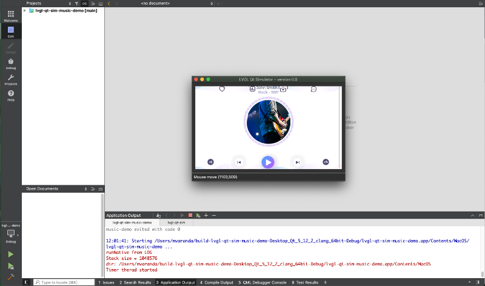
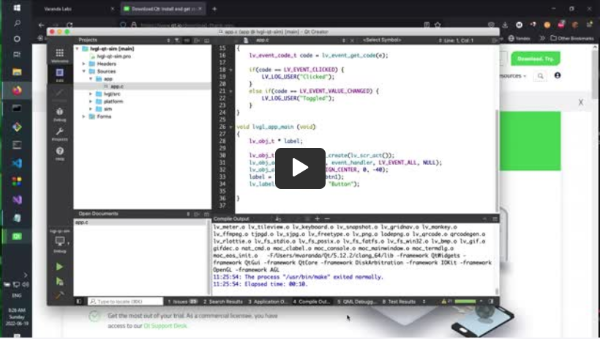

# lvgl-qt-sim
A simple LVGL Simulator. Qt Creator IDE makes easier to develop LVGL UI Apps.
<br>
Note that your App is portable to any LVGL supported Embedded System. <br>
Qt just provides the dev evironment for developing your UI.
<br>
<br>


# Installation
- install Qt (tested with 5.12.2)
- use a git shell:

```
git clone https://github.com/Varanda-Labs/lvgl-qt-sim.git
cd lvgl-qt-sim
git submodule update --init
```

- Launch Qt Creator
- Open one of the "*.pro" projects.
- Have fun

## Video

<a href="https://rumble.com/v19160b-lvgl-qt-simulator.html">
  
</a>


